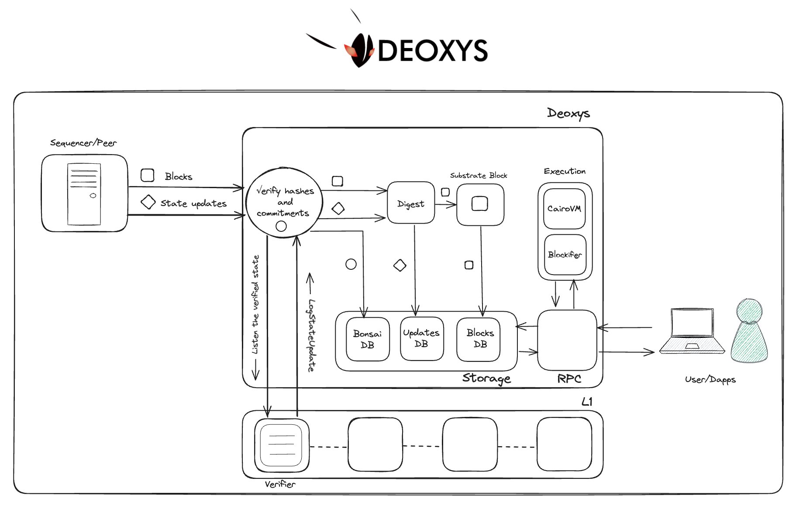

## [Kasar Labs](https://www.kasar.io/)

KasarLabs is a "Starknet engineering and research laboratory" per their [X bio](https://x.com/KasarLabs). On their website, they feature a few products :

### Starkcet
A faucet for Starknet testnet tokens. You have to make a tx on eth mainnet with the calldata being your SN testnet wallet address.
### Starknode
This is their main and biggest product. They sell plug and play SN full nodes. They sold a bit more than 200 nodes (most in late june 2023). As of mid Jan 2024, 100+ were up and running and and more than 50 have not been configured.
### KasarOS
This is the installer and montitoring set of tools that accompany Starknode.
### Deoxys
It ~~is~~ was a fork of madara, and is a SN full node client built on Substrate. From march 4th, it is no longer a fork of madara, "in order to benefit from optimizations to our needs". This doesn't end their involvment in the Madara committee. See the announcement [post on X](https://twitter.com/antiyro/status/1764644876384084442). Here's the overview of what's inside Deoxys:

### Ditto
According to [its Github repository title](https://github.com/KasarLabs/ditto), it is a library to test and benchmark starknet full nodes. It is written in Rust and makes sense when we know that the team's main project is a Starknet full node. It supports all 29 methods, supports JSON-RPC version up to 0.6.0 and supports Deoxys, Juno and Pathfinder.

I'm not sure which hardware device they're using, it looks like a raspberry pi but I don't think it is. When we talked in TLV, they weren't allowed/willing to disclose who it was. Upon installation, KasarOS lets you choose to install different clients : Papyrus from Starkware, Pathfinder from Equilibrium, or Juno from Nethermind. According to one of their setup video, Pathfinder is suitable for a 512Gb SD card and for devs, and Juno is recommended for the 256Gb version. The first version of the device was called Starknode Mew, the 256Gb version retailed for 269\$, and the 512 was 289\$. I believe it is a good but maybe hard move to build a client themselves, as they work with hardware directly. However they don't manufacture the hardware themselves, and developing a client seems to be a lot of work, I'm not sure what the value add is. Is it so that many of their customers will run Deoxys, or is it to make the experience better for node runners ? 
## Node clients
### Papyrus (Starknet)
Unknown system reqs, waiting for a reply on X . 
### Juno (Nethermind)
 - Pathfinder (Equilibrium)
 - Deoxys (Kasar Labs)
 - Sequencers
