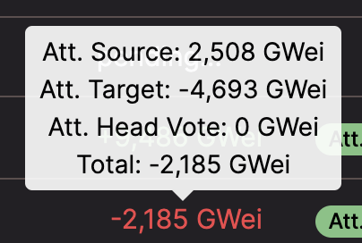

- What causes attestation target misses, as experienced by several users ? Is that normal, and what are the different steps ? 
- Are the penalties higher for missing a block ? How can they be calculated ? 
